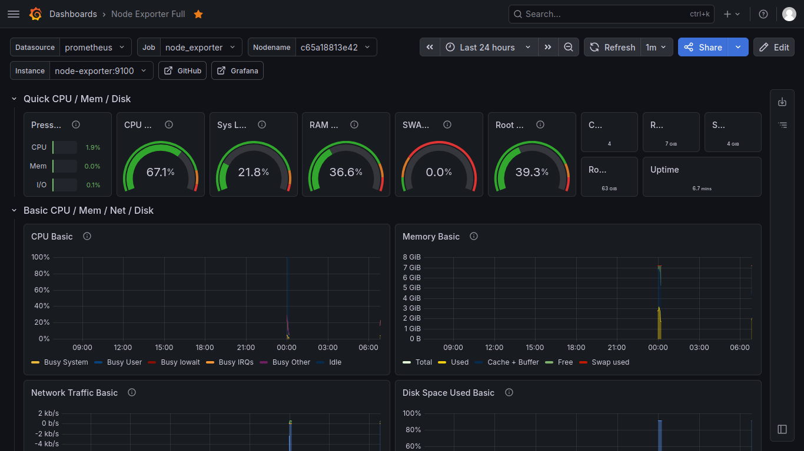

# Observability Stack

A complete, production-ready observability stack with Prometheus, Grafana, Node Exporter, and Alert Manager. Deploy in 5 minutes with one command.

## Features

- Real-time metrics – CPU, memory, disk, and network monitoring
- Beautiful dashboards – Pre-configured Grafana dashboard (ID: 1860)
- Smart alerts – Get notified when CPU >80%, memory >90%, or disk <10%
- Easy deployment – Single command with Docker Compose
- Makefile automation – Simplified management commands

## Requirements

- Docker Engine 20.10+
- Docker Compose 2.0+
- Linux server (or WSL2 on Windows)

## Quick Start

```bash
git clone https://github.com/irvaniamirali/observability-stack.git
cd observability-stack
make up
```

## Screenshots

Node Exporter dashboard showing CPU, memory, and disk metrics

## Access Services

| Service | URL | Credentials |
|---------|-----|-------------|
| Prometheus | http://localhost:9090 | - |
| Grafana | http://localhost:3000 | admin / admin |
| Alert Manager | http://localhost:9093 | - |
| Node Exporter | http://localhost:9100/metrics | - |

## Available Commands

| Command | Description |
|---------|-------------|
| make up | Start all services |
| make down | Stop all services |
| make restart | Restart all services |
| make logs | View all logs |
| make status | Check service status |
| make clean | Stop and remove all data |
| make backnewup | Backup Grafana dashboards |

## Alerts Configured

| Alert | Condition | Severity |
|-------|-----------|----------|
| High CPU Usage | >80% for 2 minutes | Warning |
| High Memory Usage | >90% for 2 minutes | Critical |
| Low Disk Space | <10% available | Warning |

## Setup Grafana Data Source

After running `make up`:

1. Open http://localhost:3000 (admin/admin)
2. Go to **Connections** -> **Data sources** -> **Add data source**
3. Select **Prometheus**
4. Set URL to: `http://prometheus:9090`
5. Click **Save & test**

## Import Dashboard

1. In Grafana, go to Dashboards -> Create dashboard -> Import dashboard
2. Enter dashboard ID: `1860`
3. Click **Load**
4. Select your Prometheus data source
5. Click **Import**

## Test Alerts

Simulate high CPU usage to test alerts:

### Install stress tool (if not installed)

```bash
# Debian/Ubuntu
sudo apt update && sudo apt install stress -y

# CentOS/RHEL
sudo yum install epel-release -y && sudo yum install stress -y
```

### Run CPU stress test
Run stress test on all CPU cores for 3 minutes
```bash
stress --cpu $(nproc) --timeout 180
```

### Check alerts
1. Open Prometheus Alerts page: http://localhost:9090/alerts
2. After approximately 2 minutes, HighCPUUsage alert will change from `PENDING` to `FIRING`
3. Check Alert Manager: http://localhost:9093

### Stop stress test (if needed before timeout)
```bash
sudo pkill stress
```

## Contributing

Contributions are welcome! Please feel free to submit a Pull Request.

1. Fork the repository
2. Create your feature branch (`git checkout -b feature/amazing-feature`)
3. Commit your changes (`git commit -m 'Add some amazing feature'`)
4. Push to the branch (`git push origin feature/amazing-feature`)
5. Open a Pull Request


## License

MIT License - see LICENSE file for details.
